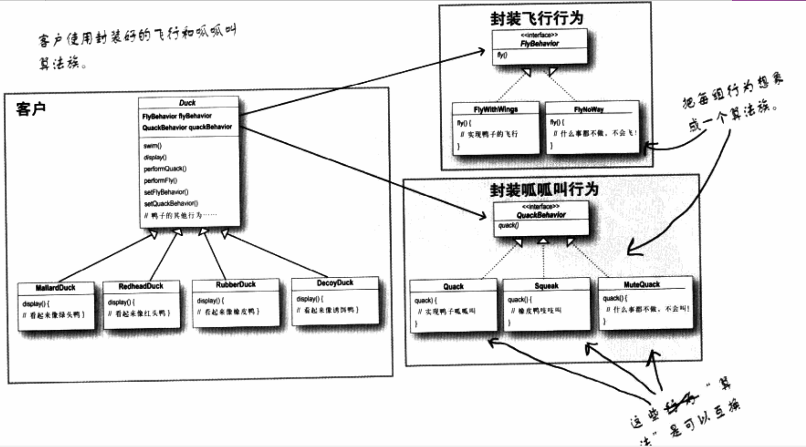

# 策略模式

演示代码为关二爷切换武器的场景，下面Readme中讲的是 《HeadFrist中的策略模式》

**一个问题有多个解决方法**，或者说一个实体有多种表现形式。

但是这多个解决方法或表现形式**只需要选择一种就够了**。

想要封装这多种解决方法，供选用。

### 场景分析

鸭子类，假定所有的鸭子都是可以展示(display) 和游泳(swim)的。但可能有橡皮鸭（不会飞）、模型鸭（不会叫）。这个时候如何让飞和叫的这两种行为得到很好的复用哪？

 - 使用继承？
   - NO，如果在父类中直接写入飞和叫这两个行为，那么只能给子类提供一种解决方案，做不到对多种行为的封装
 - 使用接口？
   - 回导致很乱的感觉。


 -  第一步，找出变于不变


 - 第二步，针对接口编程，而不是针对实现编程


### UML



### 实现代码

绿头鸭类
```java
public class MallardDuck extends Duck {
  public MallardDuck() {
    quackBehavior = new GaGaQuack();  // quackBehavior是叫声接口类型
    flayBehavior = new FlyWithWings(); //flayBehavior是飞行接口类型
  }
  // 实现接口
  public void display() {
    System.out.println("看起来头上有点绿");
  }
}
```

鸭子类
```java
public abstract class Duck {

  // 为接口类型声明两个引用变量，所有的鸭子子类都继承它们。
  FlyBehavior flyBehavior;  
  QuackBehavior quackBehavior;

  public Fuck{ }
  
  public void performFly() {
    flyBehavior.fly();  // 委托给行为类
  }
  
  public void performQuack() {
    quackBehavior.quack();  // 委托给行为类
  }

  public void swim() {
    System.out.println("所有的鸭子都可以浮起来游泳。");
  }
}
```

FlyBehavior 行为实现类
```java
// 接口
public interface FlyBehavior {
  public void fly();
}

// 实现各种行为，这些行为之间是只能选用一个的
public class FlyWithWings implements FlyBehavior {
  public void fly() {
    System.out.println("我可以用翅膀飞");
  }
}

public class FlyNoWay implements FlyBehavior {
  public void fly() {
    System.out.println("我不可以飞");
  }
}
```

QuackBehavior 行为实现类
```java
public interface QuackBehavior {
  public void quack();
}

// 实现各种行为，这些行为之间是只能选用一个的
public class GuaGuaQuack implements QuackBehavior {
  public void quack() {
    System.out.println("我 gua gua 叫");
  }
}

public class SilenceQuack implements QuackBehavior {
  public void quack() {
    System.out.println("我沉默");
  }
}
```


编译测试类

```java
public class MiniDuckSimulator {
  public static void main(String[], args) {
    Duck mallard = new MallardDuck();
    mallard.performQuack();
    mallard.performFly();
  }
}
```

### 动态设定行为
在鸭子类种添加新方法
```java
public void setFlyBehaver(FlyBehavior fb) {
  flyBehavior = fb;
}
public void setQuackBehaver(QuackBehavior qb) {
  quackBehavior = qb;
}
```