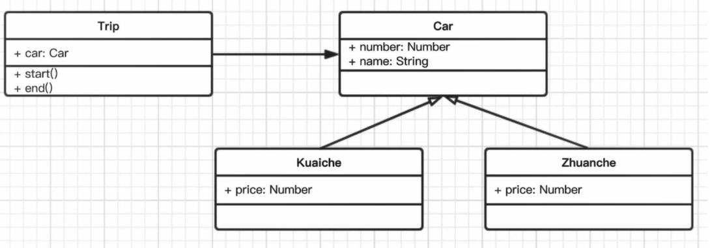
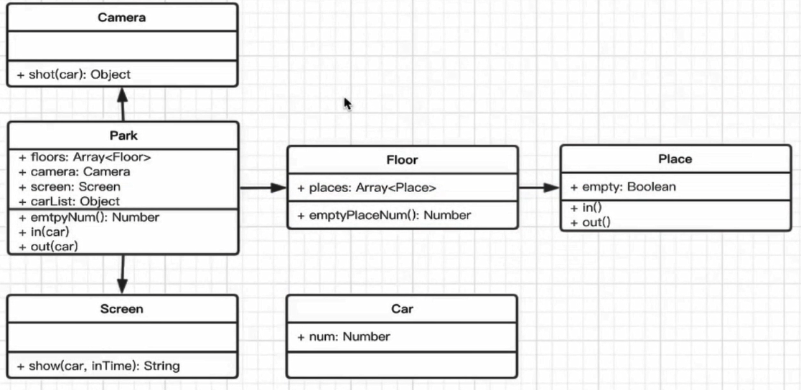

# 场景应用

### 打车问题

 - 打车时，可以打专车或快车。任何车都有车牌和名称，
 - 不同车价格不同，快车每公里1元，专车每公里2元。
 - 行程开始时，显示车辆信息。
 - 行程结束时，显示打车金额（假定行程为5公里）

题目：
 - 画出UML类图
 - 用ES6语法写出该实例



```js
class Car{
  constructor(number, name) {
    this.number = number;
    this.name = name;
  }
}

class FastCar extends Car {
  constructor(number, name) {
    super(number, name);
    this.price = 1;
  }
}

class SpecialCar extends Car {
  constructor(number, name) {
    super(number, name);
    this.price = 1;
  }
}
```

```js
class Trip {
  constructor(car) {
    this.car = car;
  }
  start() {
    console.log(`行程开始， 车名:${this.car.name}， 车牌号：${this.car.price * 5}`)
  }
  end(distance) {
    console.log(`行程结束，价格：${this.car.price * distance}`)
  }
}
```

```js
let car = new FastCar(100, '本田');
let trip = new Trip(car);

trip.start();
trip.end(5);
```


### 停车厂问题
 - 某停车场，分n层，每层m个车位
 - 每隔车位都能监控到车辆的驶入和离开
 - 车辆进入前展示每层空余车位数量
 - 车辆进入时，摄像头可识别车牌号和时间
 - 车辆出来时，出口显示器显示车牌号和停车时间

题目： 画出UML类图

分析：
 - 停车场
   - 有n层
 - 层
 - 车位
   - 监控车辆驶入、离开
 - 车
   - 车牌

